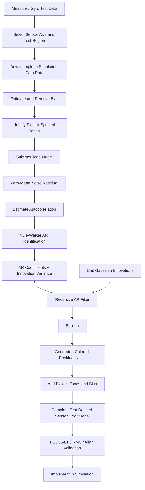

# Test-Derived Gyro Colored-Noise Model

## 1. Objective

The objective of this work is to replace a simplified gyro noise model based only on an RMS-scaled white-noise input with a **test-derived stochastic error model** that reproduces the behavior observed in measured sensor data.

A conventional white-noise implementation can reproduce the total noise magnitude, but it cannot reproduce:

- Frequency-dependent noise structure
- Narrow-band tones
- Temporal correlation between samples
- Colored spectral behavior
- Differences in behavior over different averaging time scales

The developed model therefore separates the measured gyro error into three components:

$$
x_{\text{error}}[k] = b + x_{\text{tones}}[k] + x_{\text{AR}}[k]
$$

where:

- $b$ = measured sensor bias
- $x_{\text{tones}}[k]$ = explicitly modeled deterministic tonal content
- $x_{\text{AR}}[k]$ = colored stochastic residual generated by an autoregressive model

The purpose of the AR model is **not** to reproduce the exact measured time trace. It is to generate new random realizations having statistical behavior representative of the measured gyro residual.

---

## 2. High-Level Methodology



The fundamental idea is:

> **Use measured temporal correlation to identify a linear stochastic model, then drive that model with independent Gaussian noise to generate new noise sequences having the measured statistical structure.**

---

## 3. Presentation-Level Summary

### Slide 1 — Why a Test-Derived Colored-Noise Model?

- Existing sensor model approximates gyro noise using **RMS-scaled white Gaussian noise**
- Test data contains **tones and correlated frequency-dependent noise**
- Equal RMS does **not** imply equivalent stochastic behavior
- Measured gyro error is separated into:
  - Bias
  - Explicit tones
  - Colored stochastic residual
- The stochastic residual is modeled using an **autoregressive process**
- Model validation is based on:
  - PSD
  - Tone frequency and power
  - Autocorrelation
  - RMS
  - Allan deviation
  - AR innovation whiteness

### Slide 2 — AR Identification Using Yule–Walker

The measured residual is modeled as:

$$
x[k] + a_1 x[k-1] + a_2 x[k-2] + \cdots + a_p x[k-p] = e[k]
$$

where:

- $x[k]$ = measured stochastic residual
- $p$ = AR model order
- $a_i$ = AR coefficients
- $e[k]$ = unpredictable innovation

The AR coefficients are calculated from the measured autocorrelation using the **Yule–Walker equations**.

MATLAB implementation:

```matlab
[aNoise, noiseVar] = aryule(testResidual, noiseOrder);
bNoise = sqrt(noiseVar);
```

The resulting stochastic filter is:

$$
H(z) = \frac{\sqrt{\sigma_e^2}}{1 + a_1 z^{-1} + a_2 z^{-2} + \cdots + a_p z^{-p}}
$$

where:

$$
\sigma_e^2 = \texttt{noiseVar}
$$

### Slide 3 — Noise Generation and Simulation Implementation

The identified AR model is driven by unit Gaussian noise:

$$
w[k] \sim \mathcal{N}(0,1)
$$

with:

$$
e[k] = \sqrt{\sigma_e^2}\, w[k]
$$

The recursive model is therefore:

$$
x[k] = \sqrt{\sigma_e^2}\, w[k] - \sum_{i=1}^{p} a_i x[k-i]
$$

The simulation must therefore:

1. Generate unit Gaussian innovations
2. Apply the AR recurrence
3. Retain the previous $p$ AR outputs
4. Allow startup transients to decay using burn-in
5. Add the explicitly modeled tones
6. Add the measured bias
7. Inject the resulting error into the simulated gyro measurement

The final model is:

$$
x_{\text{model}}[k] = b + \sum_{i=1}^{N_t} A_i \sin(2\pi f_i t_k + \phi_i) + x_{\text{AR}}[k]
$$

---

## 4. Why RMS White Noise Is Insufficient

RMS describes the total average noise magnitude:

$$
x_{\text{RMS}} = \sqrt{E[x^2]}
$$

However, RMS contains no information about **where that noise energy occurs in frequency**.

Two signals can have:

$$
x_{\text{RMS},1} = x_{\text{RMS},2}
$$

while having completely different PSDs.

For ideal discrete white noise:

$$
R_x[m] \approx 0, \qquad m \neq 0
$$

and the PSD is approximately flat.

A real sensor may instead exhibit:

- Narrow spectral peaks
- Mechanical or electrical tones
- Low-frequency structure
- Colored broadband noise
- Significant nonzero correlation between consecutive samples

> **RMS answers "how much noise?" while PSD and autocorrelation describe "how does the noise behave?"**

---

## 5. Why Autocorrelation Matters

Autocorrelation measures the relationship between a signal and delayed versions of itself.

For a stationary sequence:

$$
R_x[m] = E[x[k]\,x[k-m]]
$$

where $m$ is the lag.

For ideal white noise:

$$
R_x[m] = 0 \qquad m \neq 0
$$

because different samples are uncorrelated.

For colored gyro noise:

$$
R_x[m] \neq 0
$$

for some nonzero lags.

This means that the current error contains statistical information about previous errors. That temporal memory is exactly what the AR model represents.

PSD and autocorrelation are closely related through the Fourier transform:

$$
S_x(e^{j\omega}) = \mathcal{F}\{R_x[m]\}
$$

Therefore, fitting the temporal correlation of the measured process also determines its spectral structure.

---

## 6. Why Use Yule–Walker?

The AR model assumes:

$$
x[k] + a_1 x[k-1] + \cdots + a_p x[k-p] = e[k]
$$

The innovation $e[k]$ represents new information that cannot be predicted from the previous samples.

For positive lag $m$, multiply the equation by $x[k-m]$ and take the expectation:

$$
E[x[k]x[k-m]] + a_1 E[x[k-1]x[k-m]] + \cdots + a_p E[x[k-p]x[k-m]] = E[e[k]x[k-m]]
$$

Because the new innovation is uncorrelated with previous samples:

$$
E[e[k]x[k-m]] = 0
$$

Therefore:

$$
r[m] + a_1 r[m-1] + \cdots + a_p r[m-p] = 0
$$

where:

$$
r[m] = E[x[k]x[k-m]]
$$

is the autocorrelation.

For an AR($p$) process, the equations can be written in matrix form as a Toeplitz autocorrelation matrix $\mathbf{R}$ times the coefficient vector $\mathbf{a}$, equal to the negative of the lagged autocorrelation vector:

$$
\mathbf{R}\,\mathbf{a} = -\mathbf{r}
$$

where $\mathbf{R}$ is the $p \times p$ symmetric Toeplitz matrix of autocorrelation lags, $\mathbf{a} = [a_1, a_2, \ldots, a_p]^T$, and $\mathbf{r} = [r[1], r[2], \ldots, r[p]]^T$:

```text
        r[0]     r[1]     ...  r[p-1]        a_1        r[1]
        r[1]     r[0]     ...  r[p-2]        a_2        r[2]
R   =   r[2]     r[1]     ...  r[p-3]   a =  a_3    r = r[3]
         :        :        :      :           :          :
        r[p-1]   r[p-2]   ...  r[0]          a_p        r[p]

Yule-Walker system:   R * a = -r
```

Each entry $r[m] = E[x[k]\,x[k-m]]$, and $\mathbf{R}$ is symmetric because $r[m] = r[-m]$ for a real-valued stationary process. Solving this linear system for $\mathbf{a}$ gives the AR coefficients. These are the **Yule–Walker equations**.

Conceptually:

```text
Measured residual
        |
        v
Measured autocorrelation
        |
        v
Yule-Walker equations
        |
        v
AR coefficients
        |
        v
Recursive stochastic filter
```

This makes Yule–Walker particularly appropriate because the model is identified directly from the observed correlation of the measured sensor data.

---

## 7. Why Use an AR Model?

An autoregressive model is useful because it provides a compact, recursive representation of correlated stochastic noise.

Instead of storing a complete prerecorded noise sequence, the simulation only needs:

- AR coefficients
- Innovation variance
- Previous AR output values
- A Gaussian random-number generator

The model then generates an arbitrarily long stochastic sequence in real time. The AR structure is also computationally convenient because only previous sequence values are required.

---

## 8. What Does `noiseVar` Mean?

MATLAB returns:

```matlab
[aNoise, noiseVar] = aryule(testResidual, noiseOrder);
```

`aNoise` defines the temporal/spectral shape of the AR process.

`noiseVar` is the estimated variance of the innovation sequence:

$$
\sigma_e^2 = \texttt{noiseVar}
$$

Therefore:

```matlab
bNoise = sqrt(noiseVar);
```

and:

$$
b_{\text{Noise}} = \sqrt{\sigma_e^2}
$$

If the random-number generator produces:

$$
w[k] \sim \mathcal{N}(0,1)
$$

then:

$$
e[k] = b_{\text{Noise}}\, w[k]
$$

has:

$$
\text{Var}(e) = b_{\text{Noise}}^2 = \sigma_e^2
$$

The roles are therefore:

| Quantity | Purpose |
|---|---|
| Unit Gaussian RNG | Supplies new random information |
| `bNoise` | Sets innovation magnitude |
| `aNoise` | Sets temporal correlation / spectral shape |

---

## 9. What the AR Filter Is Actually Doing

The AR recurrence is:

$$
x[k] = b_{\text{Noise}}\, w[k] - a_1 x[k-1] - a_2 x[k-2] - \cdots - a_p x[k-p]
$$

Every new sample contains two components:

1. A new unpredictable Gaussian innovation
2. A weighted combination of previous AR outputs

Without the second term, the result would simply be white noise. The previous-output terms create **memory**. That memory causes correlation between samples, which produces a colored frequency spectrum.

> **The RNG creates randomness; the AR recurrence gives that randomness the measured temporal structure.**

---

## 10. Why Previous History Must Be Stored

For an AR($p$) process, calculation of the current value requires the previous $p$ outputs.

For example, an AR(3) process is:

$$
x[k] = b\, w[k] - a_1 x[k-1] - a_2 x[k-2] - a_3 x[k-3]
$$

The simulation cannot evaluate $x[k]$ without knowing $x[k-1]$, $x[k-2]$, $x[k-3]$. The previous values must therefore remain persistent between simulation calls.

Conceptually:

```text
Current history:
    x[k-1]
    x[k-2]
    x[k-3]
        |
        v
    Calculate x[k]
        |
        v
Shift history:
    x[k]    -> newest
    x[k-1]
    x[k-2]
```

This stored history is not merely a programming requirement. It is the mechanism by which the AR model maintains temporal correlation.

---

## 11. Why Burn-In Is Necessary

At the beginning of a simulation, the AR filter usually has no real history. A simple implementation initializes:

$$
x[-1] = x[-2] = \cdots = x[-p] = 0
$$

However, zero history is not representative of a sensor that has already been operating in its normal stochastic state. The first generated outputs therefore contain an artificial **initial-condition transient**.

Burn-in means:

```text
Initialize filter
        |
        v
Generate AR noise
        |
        v
Allow initial-condition transient to decay
        |
        v
Discard these early samples
        |
        v
Begin using model output
```

After sufficient time, the influence of the artificial initialization becomes negligible and the AR process approaches its normal statistical behavior.

A more rigorous way to understand burn-in is through the dominant AR pole. If the largest pole magnitude is $r_{\max} < 1$, then an initial-condition component approximately decays as:

$$
r_{\max}^{N}
$$

For a desired residual startup influence $\epsilon$:

$$
r_{\max}^{N_{\text{burn}}} < \epsilon
$$

which gives:

$$
N_{\text{burn}} > \frac{\ln(\epsilon)}{\ln(r_{\max})}
$$

Therefore, filters with poles close to the unit circle require longer burn-in periods.

---

## 12. Why the Process Becomes Colored

The AR transfer function is:

$$
H(z) = \frac{b}{1 + a_1 z^{-1} + a_2 z^{-2} + \cdots + a_p z^{-p}}
$$

For a white-noise input having flat spectral density $S_w$:

$$
S_x(e^{j\omega}) = |H(e^{j\omega})|^2 S_w
$$

Because $S_w$ is approximately constant:

$$
S_x(e^{j\omega}) \propto |H(e^{j\omega})|^2
$$

Therefore, the AR denominator shapes the originally flat Gaussian excitation into a frequency-dependent process. That is what produces **colored noise**.

---

## 13. Where the Tones Come From

The model used here separates deterministic tones from the stochastic AR residual. The measured signal is treated conceptually as:

$$
x_{\text{test}}[k] = b + x_{\text{tones}}[k] + x_{\text{residual}}[k]
$$

The tonal component is modeled as:

$$
x_{\text{tones}}[k] = \sum_{i=1}^{N_t} A_i \sin\left(2\pi f_i t_k + \phi_i\right)
$$

where each tone contains a frequency $f_i$, amplitude $A_i$, and phase $\phi_i$.

The residual used for AR identification is:

$$
x_{\text{residual}}[k] = x_{\text{test}}[k] - b - x_{\text{tones}}[k]
$$

The complete simulation model becomes:

$$
x_{\text{model}}[k] = b + x_{\text{tones}}[k] + x_{\text{AR}}[k]
$$

> **The tones are modeled explicitly; the AR model represents the remaining colored stochastic residual.**

This distinction is important because including the same tones in both the explicit tone model and the AR fitting data could result in double-counting their contribution.

---

## 14. Why Remove Bias Before Fitting the AR Model?

Sensor bias is a different error mechanism from stochastic noise. If:

$$
y[k] = b + x[k]
$$

then retaining $b$ when identifying the AR process introduces a strong DC component. That can distort the estimated mean, the low-frequency PSD, the autocorrelation, and the AR coefficient estimates.

The bias is therefore estimated separately:

$$
b = \frac{1}{N}\sum_{k=1}^{N} y[k]
$$

and removed:

$$
x[k] = y[k] - b
$$

The AR model is then fitted to a roughly zero-mean stochastic process. The bias is added back separately during simulation. This also allows bias and colored-noise characteristics to be modified independently.

---

## 15. Why Use the Residual Instead of Raw Sensor Data?

The objective is to model **sensor error**, not physical vehicle or test motion. A measured gyro signal can be represented conceptually as:

$$
y_{\text{sensor}} = x_{\text{true}} + b + x_{\text{tones}} + n
$$

where $x_{\text{true}}$ is actual motion, $b$ is bias, $x_{\text{tones}}$ are the modeled deterministic sensor-error tones, and $n$ is the stochastic residual.

If an AR model were fitted directly to the complete raw signal, it could incorrectly interpret actual rotation, test-fixture motion, deterministic trends, bias, and other non-noise behavior as stochastic sensor dynamics.

The AR identification target is therefore the residual:

$$
r[k] = y_{\text{sensor}}[k] - \hat{x}_{\text{true}}[k] - \hat{b} - \hat{x}_{\text{tones}}[k]
$$

depending on which deterministic components are known and intentionally removed.

---

## 16. Why Can the Raw Test PSD Have Larger Peaks Than the Residual PSD?

The raw test signal contains all measured components. The residual has intentionally had some components removed. Therefore, in general:

$$
PSD_{\text{raw}} \neq PSD_{\text{residual}}
$$

If a spectral peak decreases after residualization, the interpretation depends on what was removed. A reduced peak may represent:

- A real physical motion component that should not be modeled as sensor noise
- A deterministic tone that is being modeled separately
- A component unintentionally removed during preprocessing

Therefore, when comparing PSDs, it is important to state exactly which signal the stochastic model is intended to reproduce.

For the AR component:

$$
PSD_{\text{AR}} \leftrightarrow PSD_{\text{test residual}}
$$

For the complete sensor-error model:

$$
PSD_{\text{AR + tones}} \leftrightarrow PSD_{\text{de-biased test error containing tones}}
$$

---

## 17. Why Does Increasing AR Order Improve the Fit?

An AR($p$) model contains $p$ poles. Increasing $p$ provides additional degrees of freedom for reproducing complex spectral structure.

A low-order model may reproduce broad trends but fail to match narrow peaks, multiple spectral features, or more complicated correlation behavior. A larger order allows a more detailed rational approximation of the measured residual spectrum.

In this work, model order was selected pragmatically:

> **The AR order was increased until sufficient agreement with the measured residual PSD was achieved for the spectral features relevant to the simulation.**

Increasing order indefinitely is not automatically beneficial. Excessive order can introduce higher computational cost, numerical sensitivity, spurious spectral features, and fitting of finite-record details that may not repeat in another test. The selected model order should therefore be high enough to reproduce the required behavior without adding unnecessary complexity.

---

## 18. What Does an AR Pole Mean Here?

An AR pole is primarily a **statistical-model pole**. It describes the dynamics required for the linear stochastic model to reproduce measured temporal correlation. It does not automatically represent a physical gyro mode.

Some AR poles may correspond to real mechanisms such as mechanical resonances, electronics, sensor internal dynamics, or test-fixture vibration. However, AR identification alone does not prove that physical interpretation.

A safe interpretation is:

> **AR poles parameterize the measured stochastic dynamics. Physical attribution requires separate physical or system-identification evidence.**

---

## 19. Why Validate Autocorrelation if the PSD Already Matches?

For a stationary process, PSD and autocorrelation contain related second-order information:

$$
S_x(e^{j\omega}) = \mathcal{F}\{R_x[m]\}
$$

The PSD shows how the noise power is distributed across frequency. The autocorrelation shows how strongly noise values remain related across time. Using both provides a stronger validation than RMS alone.

Model agreement should therefore include:

$$
PSD_{\text{model}}(f) \approx PSD_{\text{test}}(f)
$$

and:

$$
R_{\text{model}}[m] \approx R_{\text{test}}[m]
$$

A good match in autocorrelation directly verifies that the AR model is reproducing the measured process memory.

---

## 20. Why Use Allan Deviation?

Allan deviation evaluates stochastic behavior as a function of averaging time $\tau$. Instead of asking only "where is the power in frequency?", it also asks "how does the apparent noise level change as the observation interval changes?"

For this project, Allan deviation is used primarily as an **independent validation metric**. The desired comparison is:

$$
\sigma_{\text{A,test}}(\tau) \approx \sigma_{\text{A,model}}(\tau)
$$

over the time scales supported by the available test record. A match indicates that the generated stochastic sequence behaves similarly to the measured residual over different averaging intervals.

---

## 21. Is This an Angular Random Walk Model?

Not exactly. Angular random walk is one specific gyro-noise characteristic. The model developed here is more accurately described as:

> **A test-derived colored stochastic gyro error model using autoregressive system identification.**

The model may reproduce behavior associated with angular random walk, but it can also reproduce other colored-noise characteristics. Therefore, describing the entire model as only an "angular random walk model" would be unnecessarily restrictive.

---

## 22. Why AR Innovation Whiteness Matters

The AR relationship can be written:

$$
A(z)\, x[k] = e[k]
$$

where:

$$
A(z) = 1 + a_1 z^{-1} + \cdots + a_p z^{-p}
$$

If the AR model successfully captures the predictable temporal correlation in the measured residual, then $e[k]$ should contain relatively little remaining predictable structure. Ideally:

$$
R_e[m] \approx 0 \qquad m \neq 0
$$

and the innovation PSD should be substantially flatter than the original residual PSD.

The whiteness test therefore asks:

> **After removing the temporal structure represented by the AR model, is significant correlation still left?**

If not, that provides additional evidence that the AR model has captured the important predictable correlation in the measured residual.

---

## 23. Why the Generated Time Trace Does Not Match the Test Trace

The generated model uses a new random innovation sequence. Therefore:

$$
w_{\text{model}}[k] \neq w_{\text{test}}[k]
$$

and consequently:

$$
x_{\text{model}}[k] \neq x_{\text{test}}[k]
$$

sample-by-sample. This is expected — the goal of stochastic modeling is not to replay the original noise realization.

The quantities expected to agree are statistical properties such as RMS, PSD, autocorrelation, tone frequency and power, Allan deviation, and distribution characteristics.

> **Different waveforms with matching statistics can represent the same stochastic model.**

---

## 24. Downsampling and Aliasing

The original test data may be sampled at a higher frequency than the simulation sensor update rate. For this study, the data is intentionally reduced to the simulation rate using direct sample selection / integer-stride decimation without an anti-alias filter.

Conceptually, $f_{\text{test}} \rightarrow f_{\text{model}}$ with:

$$
N_{\text{stride}} = \frac{f_{\text{test}}}{f_{\text{model}}}
$$

for an integer ratio. This choice is specific to the current test methodology.

Normally, reducing sample rate without prefiltering can cause frequency components above the new Nyquist frequency:

$$
f_{\text{Nyquist}} = \frac{f_{\text{model}}}{2}
$$

to alias into the retained frequency band.

> **The AR model represents the discrete residual sequence produced by the selected preprocessing and sampling procedure.**

This is an important distinction. If the objective changes to reconstructing the underlying band-limited continuous sensor process rather than the intentionally decimated discrete sequence, anti-alias filtering should be considered before downsampling.

---

## 25. Validation Strategy

The model is not considered valid based only on visual agreement. The following comparisons are used.

### 25.1 PSD Agreement

Compare $PSD_{\text{AR residual}}$ against $PSD_{\text{measured residual}}$ using identical Welch-processing parameters.

Useful quantitative metrics include:

**PSD RMSE in dB**

$$
E_{\text{PSD}} = \sqrt{\frac{1}{N_f}\sum_i \left[P_{\text{model,dB}}(f_i) - P_{\text{test,dB}}(f_i)\right]^2}
$$

**Relative PSD L2 error**

$$
E_{L2,\text{PSD}} = \frac{\left\|P_{\text{model}} - P_{\text{test}}\right\|_2}{\left\|P_{\text{test}}\right\|_2}
$$

### 25.2 RMS Agreement

Time-domain RMS:

$$
x_{\text{RMS}} = \sqrt{\frac{1}{N}\sum_{k=1}^{N} x[k]^2}
$$

PSD-integrated RMS:

$$
x_{\text{RMS}} = \sqrt{\int_0^{f_N} S_x(f)\, df}
$$

These should agree within finite-record and PSD-estimation error.

### 25.3 Tone Agreement

For each explicit tone:

- Frequency error: $\Delta f_i = f_{i,\text{model}} - f_{i,\text{test}}$
- Peak PSD error: $\Delta P_i = P_{i,\text{model,dB}} - P_{i,\text{test,dB}}$
- Integrated local bandpower error:

$$
E_{P,i} = 100\, \frac{P_{i,\text{model}} - P_{i,\text{test}}}{P_{i,\text{test}}}
$$

### 25.4 Autocorrelation Agreement

Compare $R_{\text{AR}}[m]$ against $R_{\text{test}}[m]$. A useful normalized error metric is:

$$
E_{L2,\text{ACF}} = \frac{\left\|R_{\text{AR}} - R_{\text{test}}\right\|_2}{\left\|R_{\text{test}}\right\|_2}
$$

### 25.5 Allan-Deviation Agreement

Compare $\sigma_{\text{A,AR}}(\tau)$ against $\sigma_{\text{A,test}}(\tau)$ over the averaging-time range supported by the test duration.

### 25.6 Innovation Whiteness

Apply the fitted AR polynomial to the measured residual:

$$
e[k] = A(z)\, x[k]
$$

Then verify that:

- Innovation PSD is substantially flatter
- Off-zero innovation autocorrelation is reduced
- Innovation variance agrees with the fitted `noiseVar`

---

## 26. MATLAB-to-Simulation Model Transfer

The quantities transferred from MATLAB to the simulation are:

```text
Bias:
    bias

Explicit tones:
    toneFreq[]
    toneAmp[]
    tonePhase[]

AR stochastic residual:
    noiseA[]
    noiseB
```

where `noiseA` are the AR denominator coefficients and `noiseB` is the square root of the innovation variance.

The simulation generates:

$$
x_{\text{AR}}[k] = \texttt{noiseB}\, w[k] - \sum_{i=1}^{p} \texttt{noiseA}[i]\, x[k-i]
$$

with $w[k] \sim \mathcal{N}(0,1)$, and then forms:

$$
x_{\text{sensor error}} = b + x_{\text{tones}} + x_{\text{AR}}
$$

---

## 27. White-Noise vs Test-Derived Simulation Comparison

After validating the model itself, a separate analysis evaluates its effect on the simulated gyro output. Two otherwise equivalent simulation cases are compared:

**Case A — Existing white-noise model**

$$
n[k] = \sigma\, w[k], \qquad w[k] \sim \mathcal{N}(0,1)
$$

**Case B — Test-derived model**

$$
n[k] = x_{\text{tones}}[k] + x_{\text{AR}}[k]
$$

The two cases should ideally have comparable total RMS so the comparison isolates the effect of **spectral structure**, rather than simply adding more noise power.

The resulting gyro delta-angle output is then compared using PSD:

$$
PSD_{\Delta\theta,\text{white}} \quad \text{versus} \quad PSD_{\Delta\theta,\text{AR+tones}}
$$

The expected result is that the white-noise model produces broadband stochastic content, while the test-derived model produces measured spectral structure and tones in the actual simulated gyro output.

This demonstrates that the improved model changes the **sensor behavior seen by the simulation**, rather than merely producing a more complicated standalone noise waveform.

---

## 28. Complete Model Interpretation

The entire process can be summarized as:

```text
Measured test data
        |
        v
Select representative operating region
        |
        v
Match simulation sample rate
        |
        v
Separate bias
        |
        v
Identify and remove deterministic tones
        |
        v
Obtain stochastic residual
        |
        v
Measure residual autocorrelation
        |
        v
Yule-Walker AR identification
        |
        v
AR coefficients + innovation variance
        |
        v
Drive AR model with unit Gaussian noise
        |
        v
Apply burn-in
        |
        v
Generate colored stochastic residual
        |
        v
Add explicit tones
        |
        v
Add bias
        |
        v
Validate statistical agreement
        |
        v
Transfer model to simulation
```

The core model is therefore:

$$
x_{\text{model}}[k] = b + \sum_{i=1}^{N_t} A_i \sin(2\pi f_i t_k + \phi_i) + x_{\text{AR}}[k]
$$

with:

$$
x_{\text{AR}}[k] = \sqrt{\sigma_e^2}\, w[k] - \sum_{i=1}^{p} a_i\, x_{\text{AR}}[k-i]
$$

---

## 29. Q&A

| Question | Answer |
|---|---|
| **Why not just use RMS white noise?** | RMS describes total noise power but not its spectral distribution or temporal correlation. |
| **Why use an AR model?** | It provides a compact recursive representation of correlated stochastic data and can generate arbitrarily long sequences in real time. |
| **Why Yule–Walker?** | Yule–Walker directly relates measured autocorrelation to AR coefficients. |
| **Why calculate autocorrelation?** | Autocorrelation directly measures temporal memory, which is what distinguishes colored noise from independent white noise. |
| **Why remove bias first?** | Bias is a separate DC error mechanism and can distort low-frequency correlation and AR identification. |
| **Why remove tones before AR fitting?** | Tones are modeled explicitly. Removing them prevents the stochastic AR model from duplicating deterministic content. |
| **What is the residual?** | The stochastic portion remaining after components intentionally modeled separately have been removed. |
| **What does `noiseVar` represent?** | The variance of the unpredictable AR innovation required to reproduce the fitted process. |
| **Why must the RNG be unit Gaussian?** | Unit variance allows `noiseB = sqrt(noiseVar)` to set the correct innovation magnitude. |
| **Why retain previous AR values?** | The recurrence explicitly depends on past outputs. That memory produces temporal correlation. |
| **Why perform burn-in?** | Zero initialization is not representative of the stationary AR state. Burn-in allows the initialization transient to decay. |
| **What causes the model to become colored?** | The AR transfer function frequency-shapes the initially flat Gaussian excitation. |
| **Where do the tones come from?** | They are modeled explicitly using measured frequency, amplitude, and phase. |
| **Why did increasing AR order improve the PSD fit?** | More AR coefficients provide more poles and therefore more degrees of freedom for approximating complex spectral structure. |
| **Does every AR pole represent a physical sensor mode?** | No. AR poles are statistical model parameters. Physical interpretation requires separate evidence. |
| **Why validate autocorrelation if PSD already matches?** | PSD shows frequency-domain power; autocorrelation independently shows time-domain memory. |
| **Why use Allan deviation?** | It checks whether test and model behave similarly across different averaging time scales. |
| **Is this only an angular-random-walk model?** | No. It is a broader test-derived colored stochastic gyro error model. |
| **Why check innovation whiteness?** | A successful AR model should remove most predictable correlation, leaving approximately uncorrelated innovations. |
| **Why doesn't the generated trace match the measured trace point-by-point?** | They are independent stochastic realizations. Their statistical properties should match, not the individual samples. |
| **Why compare the C++ output to MATLAB?** | MATLAB validates model identification; the C++ comparison validates implementation of the same model in the simulation. |
| **Can these coefficients be reused for all future tests?** | Not automatically. The coefficients represent the sensor, axis, sample rate, and operating regime from which they were identified. |
| **Why was no anti-alias filter used during downsampling?** | Direct decimation was an intentional choice for this specific study. The resulting model therefore represents the discrete sequence produced by that preprocessing. |
| **Could aliasing affect the identified model?** | Yes. Content above the new Nyquist frequency can fold into the retained band when decimating without prefiltering. |

---

## 30. Primary References

1. **N. J. Kasdin**, *Discrete Simulation of Colored Noise and Stochastic Processes and 1/f^α Power Law Noise Generation*, Proceedings of the IEEE, Vol. 83, No. 5, 1995.

   Particularly relevant topics:
   - Stochastic-process simulation
   - Autocorrelation as an accuracy criterion
   - Linear filtering of IID / white noise
   - Direct ARMA system identification from measured data
   - Yule–Walker equations
   - Recursive AR generation
   - Sensor noise and sampling
   - Allan-variance validation

2. **J. Durbin**, *The Fitting of Time-Series Models*, 1959.

   Particularly relevant topics:
   - Autoregressive time-series models
   - Independent innovation terms
   - Serial correlation
   - Estimation of AR coefficients
   - Recursive solution of autoregressive fitting equations

---

## 31. Key Takeaway

The developed approach does not simply increase the amount of gyro noise. It changes the **statistical model of the sensor error**.

Instead of:

```text
unit Gaussian noise -> RMS scaling
```

the improved approach is:

```text
measured test behavior -> bias + tones + residual -> AR identification
-> recursive colored-noise generation -> validated simulated gyro error
```

The goal is therefore to reproduce not just noise magnitude, but also spectral behavior, temporal correlation, and time-scale behavior observed in the measured sensor.
