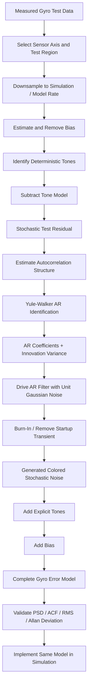

# Test-Derived Gyro Colored-Noise Model Using an Autoregressive Filter

## Objective

The purpose of this work is to replace a simplified gyro-noise representation based only on RMS-scaled white Gaussian noise with a **test-derived sensor error model** that reproduces the important behavior observed in measured gyro data.

The final sensor-error model is separated into three components:

$$
\boxed{
e_{\text{gyro}}[k]
=
b
+
e_{\text{tones}}[k]
+
e_{\text{AR}}[k]
}
$$

where:

- $b$ = measured sensor bias
- $e_{\text{tones}}$ = deterministic tonal components identified from test
- $e_{\text{AR}}$ = stochastic colored residual modeled with an autoregressive filter

This architecture is intentionally modular:

- bias is modeled separately,
- deterministic tones are modeled explicitly,
- the AR filter models the remaining correlated stochastic residual.

The goal is **not** to reproduce the exact measured waveform sample-by-sample. The goal is to generate new random realizations having the same important statistical behavior as the measured sensor error.

---

# 1. Why Replace RMS White Noise?

A conventional sensor-noise model may be represented as:

$$
e[k] = \sigma w[k]
$$

where:

$$
w[k] \sim \mathcal{N}(0,1)
$$

and $\sigma$ is chosen from a measured or specified RMS noise level.

This reproduces the **total noise magnitude**, but it does not reproduce how that noise behaves in time or frequency.

Two signals may have the same RMS:

$$
\sigma_1 \approx \sigma_2
$$

while having very different:

- power spectral densities,
- autocorrelation,
- tonal content,
- persistence,
- time-scale behavior.

White noise has approximately equal power across frequency and no correlation between different samples:

$$
R_{ww}[m] \approx 0,
\qquad m \neq 0
$$

Measured gyro noise can instead contain:

- frequency-dependent colored noise,
- discrete tones,
- resonant behavior,
- low-frequency structure,
- correlation between consecutive measurements.

Therefore:

> **Matching RMS alone does not guarantee that the simulated gyro behaves like the measured gyro.**

The purpose of the test-derived model is to reproduce these additional characteristics.

---

# 2. Overall Model-Identification Methodology

The complete workflow is:



The resulting model can be written as:

$$
e_{\text{gyro}}[k]
=
b
+
\sum_{i=1}^{N_t}
A_i
\sin
\left(
2\pi f_i k\Delta t+\phi_i
\right)
+
e_{\text{AR}}[k]
$$

---

# 3. Why Remove the Bias First?

Assume the measured signal contains:

$$
y[k]
=
b+x[k]
$$

where:

- $b$ is a constant or slowly varying bias,
- $x[k]$ is the zero-mean stochastic component.

The bias is estimated from the selected test region:

$$
b \approx \frac{1}{N}\sum_{k=1}^{N}y[k]
$$

and removed:

$$
x[k]=y[k]-b
$$

before performing stochastic identification.

## Why?

The AR filter is intended to model **fluctuations about the mean**, not the mean itself.

Leaving the bias in the data would introduce a strong DC component and could distort the estimated low-frequency correlation.

Separating the bias also makes the final model modular:

$$
\boxed{
\text{bias}
+
\text{tones}
+
\text{colored stochastic residual}
}
$$

The bias can then be changed or updated independently of the AR model.

---

# 4. Why Identify and Remove the Tones Separately?

The model architecture used here is:

$$
\boxed{
\text{Bias}
+
\text{Explicit Tones}
+
\text{AR Residual}
}
$$

The deterministic tone model is:

$$
e_{\text{tones}}[k]
=
\sum_{i=1}^{N_t}
A_i
\sin
\left(
2\pi f_i k\Delta t+\phi_i
\right)
$$

The tone model is subtracted from the de-biased measurement before fitting the AR model:

$$
r[k]
=
y[k]
-
b
-
e_{\text{tones}}[k]
$$

where $r[k]$ is the **test residual**.

The AR filter is then identified from:

$$
\boxed{r[k]}
$$

rather than the original measurement.

This prevents the AR model and explicit sinusoidal model from attempting to represent the same feature twice.

The complete reconstructed noise model is:

$$
\boxed{
e_{\text{model}}[k]
=
b
+
e_{\text{tones}}[k]
+
e_{\text{AR}}[k]
}
$$

---

# 5. Why Use the Test Residual Instead of the Raw Signal?

The raw sensor signal may contain more than sensor noise.

Conceptually:

$$
y_{\text{sensor}}
=
x_{\text{physical}}
+
b
+
e_{\text{tones}}
+
e_{\text{stochastic}}
$$

Possible non-noise content includes:

- actual physical rotation,
- commanded motion,
- test-fixture motion,
- deterministic trends,
- sensor bias,
- other known deterministic components.

The AR model should not unintentionally learn these effects as stochastic sensor noise.

Therefore the identification target is the portion specifically intended to be stochastic:

$$
\boxed{
r[k]
=
y[k]
-
\text{components modeled separately}
}
$$

For this model:

$$
r[k]
=
y[k]
-
b
-
e_{\text{tones}}[k]
$$

The AR filter is therefore a model of the **remaining stochastic residual**, not the complete raw sensor measurement.

---

# 6. Autocorrelation: What Is It and Why Is It Important?

Autocorrelation measures how strongly a signal is related to delayed versions of itself.

For a zero-mean discrete signal:

$$
R_{xx}[m]
=
E
\left[
x[k]x[k-m]
\right]
$$

where $m$ is the lag.

For white noise:

$$
R_{ww}[m] \approx 0,
\qquad m\neq0
$$

because one sample tells us essentially nothing about the next sample.

For colored noise:

$$
R_{xx}[m] \neq 0
$$

for some nonzero lags.

This means previous sensor-error samples contain statistical information about future samples.

That is the **memory** of the stochastic process.

---

## Why Autocorrelation Is Central to the AR Model

The entire AR model is based on the idea that the present value is related to previous values:

$$
x[k]
=
-a_1x[k-1]
-a_2x[k-2]
-\cdots
-a_px[k-p]
+
e[k]
$$

If the measured residual has significant autocorrelation, then previous samples can partially predict the next one.

The AR coefficients encode that relationship.

The Yule-Walker equations provide the mathematical connection:

$$
\boxed{
\text{Measured Autocorrelation}
\rightarrow
\text{AR Coefficients}
}
$$

---

# 7. AR Model Identification Using Yule-Walker

An AR model of order $p$ is written as:

$$
x[k]
+
a_1x[k-1]
+
a_2x[k-2]
+
\cdots
+
a_px[k-p]
=
e[k]
$$

where:

- $x[k]$ is the colored stochastic process,
- $p$ is the AR order,
- $a_1,\ldots,a_p$ are AR coefficients,
- $e[k]$ is the new unpredictable innovation.

The assumption is that once the predictable dependence on previous samples is removed, the remaining innovation is approximately uncorrelated.

In MATLAB:

```matlab
[aNoise, noiseVar] = aryule(testResidual, noiseOrder);
```

produces:

- `aNoise` — AR denominator coefficients
- `noiseVar` — estimated innovation variance

The corresponding transfer function is:

$$
\boxed{
H(z)
=
\frac{\sqrt{\sigma_e^2}}
{1+a_1z^{-1}+a_2z^{-2}+\cdots+a_pz^{-p}}
}
$$

with:

$$
\sigma_e^2 = \texttt{noiseVar}
$$

---

# 8. Why the Yule-Walker Equations Work

Start with the AR equation:

$$
x[k]
+
a_1x[k-1]
+
\cdots
+
a_px[k-p]
=
e[k]
$$

Multiply by an earlier sample $x[k-m]$ and take the expected value:

$$
E
\left[
x[k]x[k-m]
\right]
+
a_1E
\left[
x[k-1]x[k-m]
\right]
+\cdots
=
E
\left[
e[k]x[k-m]
\right]
$$

For $m>0$, the innovation is assumed uncorrelated with previous process values:

$$
E
\left[
e[k]x[k-m]
\right]
=0
$$

Therefore:

$$
r[m]
+
a_1r[m-1]
+
a_2r[m-2]
+
\cdots
+
a_pr[m-p]
=
0
$$

where:

$$
r[m]
=
E
\left[
x[k]x[k-m]
\right]
$$

is the autocorrelation.

The system can be written as:

$$
\begin{bmatrix}
r[0] & r[1] & \cdots & r[p-1]\\
r[1] & r[0] & \cdots & r[p-2]\\
\vdots & \vdots & \ddots & \vdots\\
r[p-1] & r[p-2] & \cdots & r[0]
\end{bmatrix}
\begin{bmatrix}
a_1\\
a_2\\
\vdots\\
a_p
\end{bmatrix}
=
-
\begin{bmatrix}
r[1]\\
r[2]\\
\vdots\\
r[p]
\end{bmatrix}
$$

Solving this system determines the AR coefficients that reproduce the measured correlation structure.

Conceptually:

$$
\boxed{
R_{xx}[m]
\rightarrow
a_1,\ldots,a_p
\rightarrow
H(z)
}
$$

This is why the method is well suited to measured stochastic sensor data.

---

# 9. What Does `noiseVar` Mean?

MATLAB returns:

```matlab
[aNoise, noiseVar] = aryule(x,p);
```

The AR coefficients determine the **shape and correlation** of the process.

`noiseVar` determines how strongly the AR model must be excited.

If:

$$
w[k]\sim\mathcal{N}(0,1)
$$

then define:

$$
e[k]
=
\sqrt{\texttt{noiseVar}}\;w[k]
$$

Therefore:

$$
\operatorname{Var}(e)
=
\texttt{noiseVar}
$$

The implementation uses:

```matlab
bNoise = sqrt(noiseVar);
```

and the transfer function becomes:

$$
H(z)
=
\frac{b_{\text{Noise}}}
{A(z)}
$$

where:

$$
A(z)
=
1+a_1z^{-1}+\cdots+a_pz^{-p}
$$

A useful interpretation is:

| Quantity | Role |
|---|---|
| Unit Gaussian RNG | Supplies new randomness |
| `noiseVar` / `bNoise` | Sets innovation magnitude |
| AR coefficients | Shape the temporal and spectral behavior |

---

# 10. What the AR Filter Is Actually Doing

The simulation begins with independent Gaussian samples:

$$
w[k]\sim\mathcal{N}(0,1)
$$

The AR recurrence is:

$$
\boxed{
x[k]
=
b_{\text{Noise}}w[k]
-
\sum_{i=1}^{p}
a_ix[k-i]
}
$$

The new output therefore consists of:

1. a new random contribution,
2. contributions from previous output values.

That second term creates **memory**.

Without the AR recursion:

$$
x[k]
=
b_{\text{Noise}}w[k]
$$

and the noise remains essentially white.

With the AR recursion:

$$
x[k]
=
b_{\text{Noise}}w[k]
-
a_1x[k-1]
-\cdots
-a_px[k-p]
$$

the output becomes correlated.

A useful verbal explanation is:

> **The Gaussian RNG supplies unpredictable energy. The AR filter reshapes that energy in time by feeding previous noise values back into the calculation. That feedback produces the measured temporal correlation and corresponding colored spectrum.**

---

# 11. Why the Process Becomes Colored

The AR filter transfer function is:

$$
H(z)
=
\frac{b}
{1+a_1z^{-1}+\cdots+a_pz^{-p}}
$$

For a white input:

$$
S_w(\omega)=\text{constant}
$$

the output PSD is:

$$
S_x(\omega)
=
|H(e^{j\omega})|^2
S_w(\omega)
$$

Because the input PSD is flat:

$$
\boxed{
S_x(\omega)
\propto
|H(e^{j\omega})|^2
}
$$

Therefore the AR transfer function determines where the originally broadband white-noise energy appears in frequency.

The filter is what converts:

$$
\boxed{\text{white innovations}}
$$

into:

$$
\boxed{\text{colored stochastic noise}}
$$

---

# 12. Why Previous History Must Be Stored

For an AR($p$) filter:

$$
x[k]
=
bw[k]
-
a_1x[k-1]
-
a_2x[k-2]
-\cdots
-a_px[k-p]
$$

the current output cannot be calculated without knowing the previous $p$ outputs.

For example, an AR(3) model requires:

$$
x[k-1],\quad x[k-2],\quad x[k-3]
$$

to calculate $x[k]$.

The simulation must therefore retain persistent filter state.

Conceptually:

```text
Current history:

x[k-1]
x[k-2]
x[k-3]
...
x[k-p]

        ↓

Calculate x[k]

        ↓

Shift history

        ↓

x[k] becomes newest stored value
```

This persistent history is not merely a coding requirement.

It is the mechanism that gives the stochastic process **memory and correlation**.

---

# 13. Why Burn-In Is Necessary

At the beginning of the simulation, the AR filter does not have a physically representative history.

It is typically initialized as:

$$
x[-1]
=
x[-2]
=
\cdots
=
x[-p]
=
0
$$

but a sensor that has been operating normally would already have a statistically valid history.

Therefore the first AR outputs contain the response of the filter to an artificial initial condition.

This produces a startup transient.

The solution is to:

1. initialize the filter,
2. drive it with random innovations,
3. allow the transient to decay,
4. discard these initial values,
5. begin using the output only after the filter has reached its representative stochastic behavior.

This is the **burn-in period**.

Conceptually:

```text
Initialize history to zero
        ↓
Run AR filter
        ↓
Startup transient decays
        ↓
Discard burn-in samples
        ↓
Use statistically settled output
```

The reason for burn-in can therefore be summarized as:

> **Burn-in prevents arbitrary filter initial conditions from contaminating the simulated sensor-noise statistics.**

---

## Burn-In and Pole Location

If the dominant AR pole has magnitude:

$$
r_{\max}
$$

then an initialization transient approximately decays as:

$$
r_{\max}^{n}
$$

To reduce the influence below a desired fraction $\epsilon$:

$$
r_{\max}^{N_{\text{burn}}}
<
\epsilon
$$

which gives:

$$
N_{\text{burn}}
>
\frac{\ln(\epsilon)}
{\ln(r_{\max})}
$$

This provides a more rigorous way to understand why filters with poles very close to the unit circle require longer settling periods.

---

# 14. Where Do the Tones Come From?

In this implementation, the tones are **not intentionally produced by the AR residual model**.

They are explicitly identified and modeled separately.

The complete model is:

$$
e[k]
=
b
+
\sum_i
A_i
\sin
\left(
2\pi f_i k\Delta t+\phi_i
\right)
+
e_{\text{AR}}[k]
$$

This is important when describing the model:

> **The AR filter represents the correlated stochastic residual after bias and deterministic tonal components are removed. The complete sensor model reconstructs the test behavior by adding the bias, explicit tones, and AR residual together.**

The AR model should therefore primarily be validated against the **test residual**, while the complete reconstructed model should be validated against the corresponding test signal containing those tones.

---

# 15. What Does an AR Pole Mean?

The AR denominator is:

$$
A(z)
=
1+a_1z^{-1}+\cdots+a_pz^{-p}
$$

The roots of:

$$
A(z)=0
$$

are the poles of the AR model.

These poles determine the dynamic memory of the stochastic filter.

A pole nearer the unit circle generally corresponds to a more persistent stochastic response.

Complex-conjugate pole pairs can create frequency-selective behavior.

However:

> **An AR pole is not automatically a physical mechanical mode of the gyro.**

The AR model is primarily a statistical or phenomenological model.

Its poles compactly represent the measured temporal correlation.

A pole may correspond to a real mechanical or electrical mechanism, but demonstrating that requires separate physical system identification.

---

# 16. Why Increasing AR Order Can Improve the Fit

An AR($p$) model contains $p$ denominator coefficients and therefore has more degrees of freedom as $p$ increases.

A low-order model may reproduce only broad spectral shape.

A higher-order model can reproduce more complicated behavior such as:

- multiple colored regions,
- narrow spectral features,
- complicated correlation structure,
- sharp changes in PSD slope.

The practical approach used here was:

> **Increase the AR order until the model provided sufficient agreement with the measured residual in the frequency range and features important to the simulation.**

This is a pragmatic engineering selection criterion.

It should not be interpreted as proof that the selected order is statistically optimal.

A very high order can introduce:

- additional computational cost,
- numerical sensitivity,
- unnecessary model complexity,
- fitting of finite-record behavior that may not repeat in future tests.

The desired order is therefore the **lowest order that provides sufficient fidelity for the intended simulation use**.

---

# 17. Downsampling and Aliasing

The test data is reduced to the rate used for model identification and simulation.

For this particular study, the downsampling is intentionally performed by direct sample selection / decimation **without an anti-aliasing filter**.

That is a deliberate test-processing choice.

However, it has an important interpretation.

If the original sampling rate is:

$$
f_s
$$

and the new rate is:

$$
f_d
$$

then the new Nyquist frequency is:

$$
f_{N}
=
\frac{f_d}{2}
$$

Any original spectral content above this frequency can alias into the lower-frequency band after direct decimation.

Therefore:

> **The AR model identified from directly decimated data represents the stochastic sequence produced by that specific decimation procedure.**

It should not automatically be interpreted as the anti-aliased continuous sensor spectrum at the lower sample rate.

This distinction should be retained when applying the methodology to future tests.

If the future objective is instead to represent a physically sampled sensor with anti-alias filtering, the appropriate prefilter should be included before reducing the sample rate.

For the present study, direct decimation is retained intentionally.

---

# 18. Why Validate Autocorrelation If the PSD Already Matches?

For a wide-sense stationary process, PSD and autocorrelation are Fourier-transform pairs:

$$
S_{xx}(\omega)
=
\mathcal{F}
\left\{
R_{xx}[m]
\right\}
$$

PSD answers:

> **Where is the noise power located in frequency?**

Autocorrelation answers:

> **How much memory exists between samples separated in time?**

A PSD match is therefore strong evidence of model agreement, but comparing autocorrelation provides a direct time-domain check that the AR model is reproducing the measured temporal structure.

This is especially relevant for an AR model because its entire purpose is to reproduce sample-to-sample correlation.

Desired agreement is:

$$
S_{\text{AR}}(f)
\approx
S_{\text{test}}(f)
$$

and:

$$
R_{\text{AR}}[m]
\approx
R_{\text{test}}[m]
$$

---

# 19. PSD Validation

The primary frequency-domain validation compares:

$$
PSD_{\text{AR}}
$$

against:

$$
PSD_{\text{test residual}}
$$

using identical spectral-estimation settings.

Important comparisons include:

- overall PSD shape,
- frequency-band power,
- residual RMS,
- PSD RMSE in dB.

A useful quantitative metric is:

$$
RMSE_{\text{PSD}}
=
\sqrt{
\frac{1}{N}
\sum_{i=1}^{N}
\left(
P_{\text{AR,dB}}[i]
-
P_{\text{test,dB}}[i]
\right)^2
}
$$

This converts visual agreement into a measurable quantity.

---

# 20. Tone Validation

Because the deterministic tones are modeled separately, the complete reconstructed model is:

$$
e_{\text{complete}}
=
e_{\text{AR}}
+
e_{\text{tones}}
$$

after bias removal.

The complete model can be compared against the de-biased measured test noise.

Tone metrics can include:

### Frequency error

$$
\Delta f_i
=
f_{i,\text{model}}
-
f_{i,\text{test}}
$$

### Peak PSD error

$$
\Delta P_i
=
P_{i,\text{model,dB}}
-
P_{i,\text{test,dB}}
$$

### Local integrated bandpower error

$$
P_i
=
\int_{f_i-\Delta f}^{f_i+\Delta f}
S(f)\,df
$$

This provides quantitative evidence that the explicitly modeled tones reproduce the measured spectral features.

---

# 21. Allan Deviation: What Does It Show?

Allan deviation examines stochastic behavior as a function of averaging time:

$$
\tau
$$

Rather than asking only:

> "How much noise exists at each frequency?"

it asks:

> "How does the measured variability change as the observation or averaging interval changes?"

For a rate gyro, different stochastic processes produce different trends with averaging time.

The purpose of Allan deviation in this work is primarily **validation**:

$$
\sigma_{\text{AR}}(\tau)
\approx
\sigma_{\text{test}}(\tau)
$$

over the time scales supported by the available test record.

This provides an additional check that the AR-generated process behaves like the measured process over different time scales.

---

# 22. Is This an Angular Random Walk Model?

Not exactly.

Angular random walk is one specific stochastic behavior commonly used to characterize gyro error.

The model developed here is broader:

> **A test-derived colored stochastic gyro-error model using autoregressive system identification, combined with explicit deterministic tones and bias.**

The model may reproduce behavior associated with angular random walk, but it is not limited to an ARW model.

Therefore the preferred terminology is:

> **Test-derived colored gyro-noise model**

or:

> **AR-based stochastic gyro-error model**

rather than simply:

> **Angular random walk model**

---

# 23. Why Innovation Whiteness Matters

The AR model assumes:

$$
x[k]
+
a_1x[k-1]
+\cdots+
a_px[k-p]
=
e[k]
$$

where $e[k]$ is the unpredictable innovation.

If the AR coefficients successfully capture the predictable temporal structure in the test residual, then applying the AR polynomial back to the measured residual should leave approximately uncorrelated innovations:

$$
e[k]
=
A(z)x[k]
$$

For a good AR model:

$$
R_{ee}[m]
\approx0,
\qquad m\neq0
$$

This provides an important diagnostic.

The logic is:

```text
Measured residual
      ↓
Contains temporal correlation
      ↓
AR model explains predictable correlation
      ↓
Remove AR-predicted structure
      ↓
Remaining innovation should be approximately white
```

If substantial correlation remains in the innovation sequence, the AR model has not captured all of the predictable stochastic structure.

---

# 24. Why the Generated Trace Does Not Match the Test Trace

The AR model generates a **new random realization**.

The Gaussian excitation used in simulation is different from whatever random disturbances produced the original test data.

Therefore:

$$
x_{\text{AR}}[k]
\neq
x_{\text{test}}[k]
$$

sample-by-sample.

This is expected.

A stochastic model should instead reproduce the statistical characteristics of the process:

$$
\boxed{
PSD
}
$$

$$
\boxed{
R_{xx}[m]
}
$$

$$
\boxed{
RMS
}
$$

$$
\boxed{
\text{Allan deviation}
}
$$

and, for the complete model:

$$
\boxed{
\text{tone frequencies and amplitudes}
}
$$

Therefore a direct time-history overlay is illustrative, but it is **not** the primary model-validation criterion.

---

# 25. Final Simulation Implementation

The stochastic AR component is generated recursively:

$$
e_{\text{AR}}[k]
=
b_{\text{Noise}}w[k]
-
\sum_{i=1}^{p}
a_i
e_{\text{AR}}[k-i]
$$

where:

$$
w[k]\sim\mathcal{N}(0,1)
$$

The complete gyro error is then:

$$
\boxed{
e_{\text{gyro}}[k]
=
b
+
e_{\text{tones}}[k]
+
e_{\text{AR}}[k]
}
$$

This value is then injected into the existing simulated sensor measurement using the same frame and measurement conventions as the original sensor model.

The simulation implementation therefore requires:

- AR coefficients $a_i$,
- innovation scale $b_{\text{Noise}}$,
- persistent AR history,
- unit Gaussian RNG,
- burn-in logic,
- tone frequencies,
- tone amplitudes,
- tone phases,
- sensor bias.

---

# 26. Model Validation vs Simulation Impact

These are two different questions and should remain separate.

## Model Validation

Question:

> **Does the generated test-derived model reproduce the measured gyro-error process?**

Compare:

$$
\text{Test Residual}
\quad\leftrightarrow\quad
\text{AR Residual Model}
$$

using:

- PSD,
- PSD RMSE,
- RMS,
- autocorrelation,
- Allan deviation,
- innovation whiteness.

Then compare the complete model:

$$
\text{Measured De-Biased Noise}
\quad\leftrightarrow\quad
\text{AR + Explicit Tones}
$$

for tonal behavior.

---

## Simulation Impact

Question:

> **Does using the realistic test-derived model change the simulated gyro output relative to an RMS-only white-noise model?**

Run two equivalent simulations.

### Case A — Conventional White Noise

$$
e_{\text{white}}[k]
=
\sigma w[k]
$$

### Case B — Test-Derived Model

$$
e_{\text{test-derived}}[k]
=
b
+
e_{\text{tones}}[k]
+
e_{\text{AR}}[k]
$$

Then compare the gyro delta-angle output:

$$
\Delta\theta_{\text{white}}
$$

against:

$$
\Delta\theta_{\text{AR/tone}}
$$

using PSD.

This shows whether the actual simulated gyro measurement contains the measured tonal / colored structure rather than only broadband white noise.

---

# 27. Recommended Validation Package

The complete validation set is:

| Analysis | What It Demonstrates |
|---|---|
| Residual vs AR PSD | Frequency-domain model agreement |
| PSD RMSE [dB] | Quantitative spectral agreement |
| RMS comparison | Total noise-power agreement |
| Tone frequency / bandpower error | Explicit tone-model agreement |
| Residual vs AR autocorrelation | Temporal-memory agreement |
| Allan deviation | Agreement across averaging time scales |
| Innovation PSD / autocorrelation | Whether AR model removed predictable structure |
| MATLAB vs simulation AR output | Correct simulation implementation |
| White-noise vs AR/tone $\Delta\theta$ PSD | Effect of realistic sensor model on simulated measurement |

---

# 28. Three-Slide Presentation Summary

## Slide 1 — Motivation and Sensor-Error Decomposition

- Existing model uses RMS-scaled white Gaussian noise.
- RMS reproduces total noise magnitude but not measured frequency or temporal structure.
- Test data shows structured sensor behavior requiring a colored-noise model.
- Sensor error is decomposed into:

$$
\boxed{
e_{\text{gyro}}
=
b
+
e_{\text{tones}}
+
e_{\text{AR}}
}
$$

- Bias and deterministic tones are identified separately.
- AR model is fitted to the remaining stochastic residual.
- Objective is to reproduce measured sensor-error statistics rather than the exact test waveform.

---

## Slide 2 — AR Identification Using Yule-Walker

- Form zero-mean stochastic residual:

$$
r[k]
=
y[k]
-
b
-
e_{\text{tones}}[k]
$$

- Model residual as:

$$
r[k]
+
a_1r[k-1]
+\cdots+
a_pr[k-p]
=
e[k]
$$

- Yule-Walker converts measured autocorrelation into AR coefficients:

$$
\boxed{
R_{rr}[m]
\rightarrow
a_1,\ldots,a_p
}
$$

- MATLAB:

```matlab
[aNoise, noiseVar] = aryule(residual, noiseOrder);
bNoise = sqrt(noiseVar);
```

- Final stochastic transfer function:

$$
\boxed{
H(z)
=
\frac{b_{\text{Noise}}}
{1+a_1z^{-1}+\cdots+a_pz^{-p}}
}
$$

- AR order increased until sufficient spectral fidelity was obtained.

---

## Slide 3 — Generation, Simulation, and Validation

- Drive AR filter with unit Gaussian innovations:

$$
w[k]\sim\mathcal{N}(0,1)
$$

- Generate colored residual recursively:

$$
e_{\text{AR}}[k]
=
b_{\text{Noise}}w[k]
-
\sum_{i=1}^{p}a_ie_{\text{AR}}[k-i]
$$

- Previous outputs are retained as persistent state.
- Burn-in removes startup effects caused by artificial initial filter history.
- Add explicit tones and bias to reconstruct complete sensor error.
- Validate using:
  - PSD / PSD RMSE,
  - RMS,
  - autocorrelation,
  - tone metrics,
  - Allan deviation,
  - innovation whiteness.
- Compare final simulated $\Delta\theta$ PSD for:
  - RMS white-noise model,
  - test-derived AR / tonal model.

---

# 29. Common Review Questions

| Question | Answer |
|---|---|
| **Why isn't RMS white noise sufficient?** | RMS describes total noise power but not where that power occurs in frequency or how samples are correlated in time. |
| **Why use an AR model?** | An AR model provides a compact recursive way to reproduce measured temporal correlation and colored spectral behavior. |
| **Why Yule-Walker?** | Yule-Walker directly relates the measured autocorrelation of the residual to the AR coefficients. |
| **What does `aryule()` calculate?** | It estimates the AR denominator coefficients and the variance of the remaining innovation process. |
| **What does `noiseVar` represent?** | The variance of the white innovation required to excite the identified AR process. |
| **Why use unit Gaussian noise?** | Unit variance separates the RNG from the model scaling; `sqrt(noiseVar)` then sets the required innovation magnitude. |
| **Why remove bias first?** | The AR model should represent fluctuations about the mean. Bias is a separate DC error mechanism. |
| **Why remove the tones before fitting the AR model?** | The tones are modeled explicitly, so removing them prevents double-counting and allows the AR model to represent only the stochastic residual. |
| **What exactly is the residual?** | The de-biased, tone-subtracted portion of the measured signal that remains to be modeled stochastically. |
| **Why does the filter require history?** | The current AR output explicitly depends on previous AR outputs. This memory creates temporal correlation. |
| **Why burn in the filter?** | The initially zero filter history is artificial. Burn-in allows this startup transient to decay before simulated samples are used. |
| **Why does the noise become colored?** | The AR transfer function reshapes the flat PSD of white Gaussian innovations according to $|H(e^{j\omega})|^2$. |
| **What does an AR pole represent?** | A statistical dynamic mode of the identified stochastic process; it does not necessarily correspond to a physical gyro mode. |
| **Why increase the AR order?** | More coefficients/poles allow more complicated measured correlation and spectral structure to be reproduced. |
| **Why not increase the order indefinitely?** | Higher order increases computation and numerical sensitivity and may begin fitting finite-record behavior that does not generalize. |
| **How was the order selected?** | Order was increased until sufficient agreement with the required measured spectral behavior was achieved. |
| **Why validate autocorrelation if PSD matches?** | Autocorrelation directly verifies temporal memory, which is the behavior the AR recurrence is specifically designed to reproduce. |
| **Why use Allan deviation?** | It provides an independent comparison of stochastic behavior over different averaging times. |
| **Is this an angular random walk model?** | Not specifically. It is a broader test-derived colored gyro-error model that may include ARW behavior among other stochastic characteristics. |
| **Why examine innovation whiteness?** | If the AR model captures the predictable correlation, the remaining innovation should be approximately uncorrelated. |
| **Why doesn't the generated waveform match the test waveform?** | The generated sequence is an independent random realization. Statistical properties should match, not individual samples. |
| **Why use PSD as the primary validation?** | The objective is to reproduce the measured distribution of sensor-noise power across frequency. |
| **Why compare the simulation output after implementing the model?** | MATLAB validation proves the identified model is correct; simulation-output validation proves the same model was implemented correctly in the simulation. |
| **Why compare white-noise and AR-model $\Delta\theta$ PSDs?** | It demonstrates how the improved noise representation changes the actual simulated gyro measurement. |
| **What is the consequence of downsampling without anti-alias filtering?** | The identified model represents the specifically decimated sequence and may include spectral content that has folded below the new Nyquist frequency. |
| **Can this approach be reused for future tests?** | Yes, but the model should be reidentified for the appropriate sensor, axis, operating regime, sampling rate, and test conditions rather than assuming the same coefficients universally apply. |

---

# 30. Key Takeaway

The core methodology can be summarized as:

$$
\boxed{
\text{Measured Sensor Error}
\rightarrow
\text{Bias + Tones + Stochastic Residual}
\rightarrow
\text{Yule-Walker AR Identification}
\rightarrow
\text{Recursive Colored-Noise Generator}
\rightarrow
\text{Statistical Validation}
\rightarrow
\text{Simulation}
}
$$

The model does not attempt to replay the measured test data.

Instead, it uses the measured data to identify a stochastic process capable of producing **new random sensor-error sequences with representative spectral, correlation, amplitude, and time-scale behavior**.

This provides a more physically representative simulation input than simply increasing the magnitude of broadband white Gaussian noise.

---

# References

1. N. J. Kasdin, **"Discrete Simulation of Colored Noise and Stochastic Processes and 1/f^α Power Law Noise Generation,"** *Proceedings of the IEEE*, Vol. 83, No. 5, May 1995.

   Relevant topics:
   - colored-noise simulation,
   - stochastic-process autocorrelation,
   - spectral-density estimation,
   - discrete linear stochastic systems,
   - direct ARMA identification using Yule-Walker equations,
   - recursive AR generation,
   - sensor-noise sampling and aliasing,
   - Allan-variance validation.

2. J. Durbin, **"The Fitting of Time-Series Models,"** Institute of Statistics, University of North Carolina / University of London, 1959.

   Relevant topics:
   - autoregressive time-series models,
   - serial correlation,
   - estimation of AR coefficients,
   - recursive solutions for autoregressive fitting.
